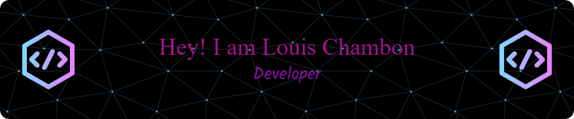

[](https://git.io/typing-svg)

## About Me : :question:
```
{
    Age: 19;
    Studying at: Epitech;
    Enjoy: {
         The Weeknd <3;
         IT;
         Partys;
         Games;
    }
}
```

 &emsp;  &emsp; 

 &emsp; &emsp;  &emsp; &emsp;  &emsp; &emsp; 


## Music : :notes:

[](https://github.com/kittinan/spotify-github-profile)


## Stats : :octopus:


## Languages & Tools : :dolphin:

   &emsp;  
&emsp; 

 &emsp; &emsp;  &emsp; &emsp;  &emsp; &emsp;  

 &emsp;  &emsp; 

 &emsp; &emsp;  &emsp; &emsp;  &emsp; &emsp; 

## Contact me: :smile:

<a href="https://www.instagram.com/louis.chmb_/"/>  &emsp; &emsp;
<a href="https://www.linkedin.com/in/louis-chambon-4175b2225/"/>  &emsp; &emsp;
<a href="yahoo.com"/> 
